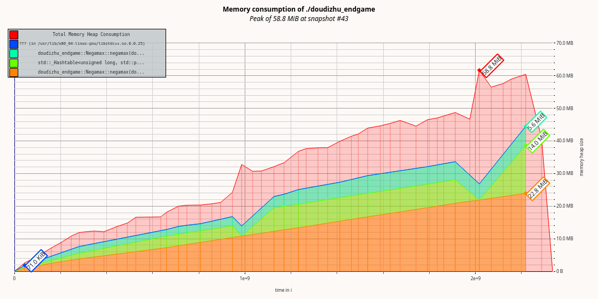

# [Doudizhu Endgame](https://github.com/YunyanDeng/doudizhu_endgame)  

这是一个高效、占用内存小的用于求解斗地主残局的项目。C++实现，使用了负极大值算法(Negamax)并使用置换表来加速搜索。

## 如何使用

```C++
#include <iostream>
#include "solution.h"

int main()
{
    namespace ddz = doudizhu_endgame;
    
    ddz::Solution solution;
    solution.start();
    
    return 0;
}
```

或者在linux下使用cmake直接构建

```
git clone https://github.com/YunyanDeng/doudizhu_endgame.git
mkdir doudizhu_endgame/build
cd doudizhu_endgame/build
cmake ../doudizhu/
make
```

## 实现

### 牌的表示

'3', '4' ... 'k', 'A', '2', 'Joker' 对应的值为 0, 1 ... 13, 14。一副牌牌54张可以用`uint64_t` 来表示，但是为了方便这里采用`bitset<64>`来代替。从低位开始 ’3‘(也就是0)存储在0,1,2,3位， 有多少张牌就有多少位为`true`比如['3', '3', '3', '5']在bitset 中表示为

```
0001 0000 0111
’5‘       ’3‘
```

所以可以用 `card<<2`来定位一张牌，更多的操作在CardSet类中。

## 牌型的筛选

实现细节在DouDiZhuHand类中，支持以下牌型:

+ 单张
+ 对子
+ 三条（带一，带对）
+ 四张（炸弹，四带两单，四带一对， 四带两对）
+ 顺子
+ 连对
+ 飞机（三顺不带，三顺带单牌，三顺带对子）
+ 王炸

## MinMax 与 Negamax

MinMax的介绍可以看[这里(en)](https://en.wikipedia.org/wiki/Minimax)和[这里(zh)](http://www.tup.tsinghua.edu.cn/upload/books/yz/035081-01.pdf)。MinMax 可以简化为 Negamax它的思想是：父节点的值是各个子节点极大值的相反数，这样避免了上一层取极大值下一层取极小值互相转换的麻烦。节点的值表示当前节点行动者的评估值。

Negamax算法表述：

```c++
int negamax(int depth)
{
    if (gameover || depth > MAX_DEPTH) {//达到最大深度返回评估值
        return evaluation;
    }
    
    int score = -1;
    for (each possible node) {
        int tmp_score = -negamax(depth + 1);
        if (tmp_score > score) {
            score = tmp_score;
            break;	//剪枝
        }
    }
    
    return score;
}
```

为了找出必胜的决策，我们搜索到一方出完牌为止。在搜索过程中只要发现必胜的决策，就不用对其兄弟节点进行搜索。

## 置换表

求解器使用了简单的置换表进行加速。表中存储了已搜索过的局面的评估值，在搜索一个节点前先在表中查找是否有与当前相同的局面。如果有直接返回存储的评估值。用当前手中的牌，对手手中的拍以及桌面上的牌（上一轮出牌）和轮次生成一个校验值`key`，存储结构使用`std::unordered_map`。

使用置换表有一个问题是当命中置换表时直接得到评估值，没有生成子节点。如果在最后博弈搜索应对策略，走到这一节点时，后面的信息并没有生成。项目采用的处理方法是用上一步的信息重新生成game tree，因为这时基本牌数已经很少重新搜索基本不花费时间。

## 树的结构

```c++
struct TreeNode {
    int8_t                   turn;        //0: lord 1:farmer
    int8_t                   score;       //评估值（对当前行动方）
    CardSet                  lord;        //地主手牌
    CardSet                  farmer;      //农民手牌
    Pattern                 *last_move;   //上一轮牌型
    std::vector<TreeNode *>  child;       //子节点
};
```

Pattern 结构如下

```c++
struct Pattern {
    int8_t	power; //牌型的权值
    Type    type;  //类型
    CardSet hand;  //牌型中包含的牌
};
```

Pattern 实例可以复用，hand生成一个值为键存在一个`std::unordered_map`中，减小内存开销。

（CardSet只使用了54位，可以考虑用后十位来表示牌型的权值和类型）。。。

## 性能

测试环境：

CPU:Intel(R) Core(TM) i5-4210U CPU @ 1.70GHz

内存: DDR3 4G

其他:  xubuntu 18.04, gcc version 7.3.0


```
lord:  "zaqqjj0999844"
farmer:"y22aa0886633"
```
上图是欢乐斗地主专家难度第五十关的valgrind massif 的测试结果。目前测试的五十关中都可以在两秒内得到结果，且占用内存少。

## 其他

+ 本项目是受到[@Whotakesmyname](https://github.com/Whotakesmyname/ChinesePokerGame)的方案启发，改进完成的。
+ 有什么问题欢迎指正。

